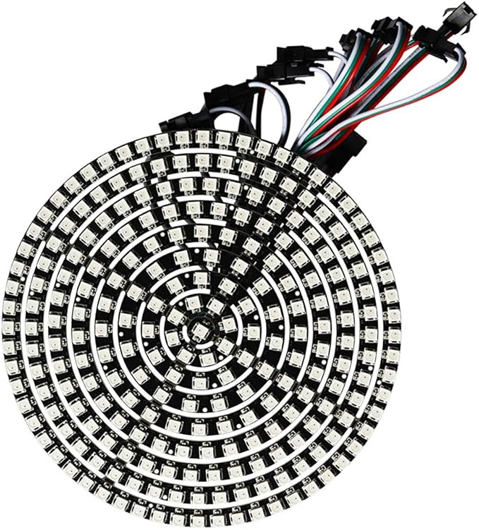

# Python library and tools for a WS2812x led disk.

This toolset works on top of the official [WS281x Python library](https://github.com/rpi-ws281x/rpi-ws281x-python) to allow you to programmatically control an entire set of WS2812x rings as single disk




# Installing
Either clone this repo, or install with 
```console
sudo pip install rpi_ws281x_disk
```

See the examples for usage!

(Docs are under construction)